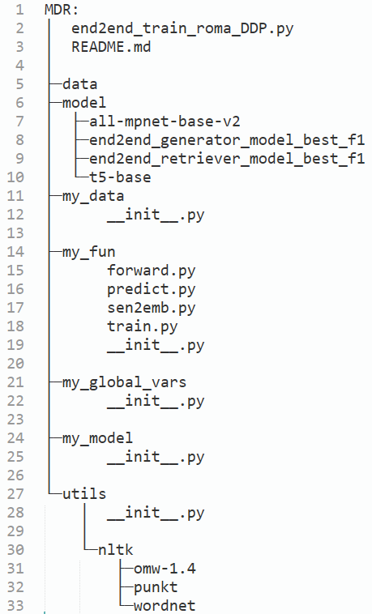
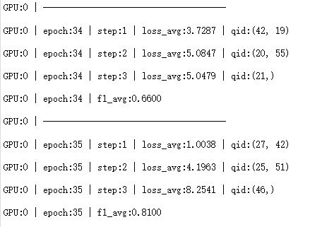

## 目录结构

 

## 关于在model arts上多机多卡使用

引擎类型：PyTorch, pytorch_1.8.0-cuda_10.2-py_3.7-ubuntu_18.04-x86_64

启动文件：/bucket-852/w50022420/myMDR/end2end_train_roma_DDP.py

运行参数：epoch=100; k=5; lr=3e-5; m=3; seed=123; train_batch_size=64(8*计算节点的倍数)

代码目录：/bucket-852/w50022420/myMDR/

## 参数解析

举例：

66：训练数据总数          

32：人为设置的batch_size（最好设置成总进程数即16的倍数） 

2：机器数                 

8：每台机器上卡数         

2*8=16：进程总数（一台机器上的进程数设置为等于卡数的情况下）

ceil 66/16=5：每个进程在每个epoch处理的训练数据量（每个进程实际能看到所有66条数据）（由于DistributedSampler中设置set_epoch方法，所以每个epoch拿到的数据都不同，即保证随机性）

ceil 32/16=2：每个进程实际的batch size

ceil 5/2=3：这样每个进程在每个epoch的step数（实际最后一个step分到的数据量只是1条）

model arts上log：

 

## 其他注意

- 可以用启动脚本启动本脚本，但是要在启动脚本中把model_arts传到启动脚本的参数传到此脚本，不然会报错(这些参数主要是涉及多机多卡的参数)（对应model arts上的实际启动命令是（自己没有指定其它参数的情况下） 同构集群: python ${MA_JOB_DIR}/myMDR/end2end_train_roma_DDP.py --init_method "tcp://$(echo ${VC_WORKER_HOSTS} | cut -d "," -f 1):6666" --rank ${VC_TASK_INDEX} --world_size 2）

- 用log记录会在各模块之间混乱，用print，调试的输出统一注释掉